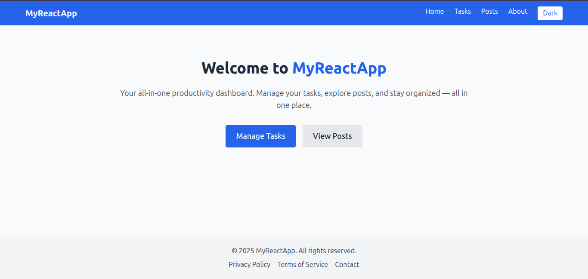
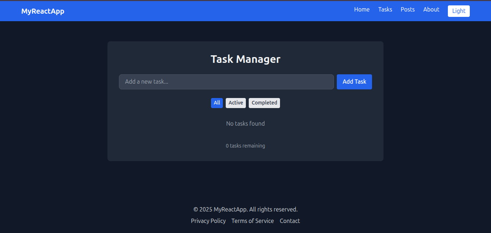
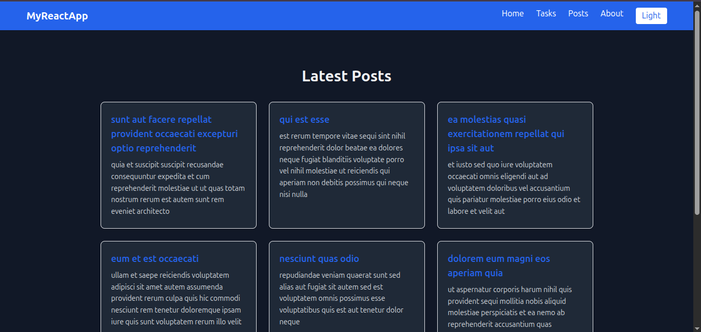
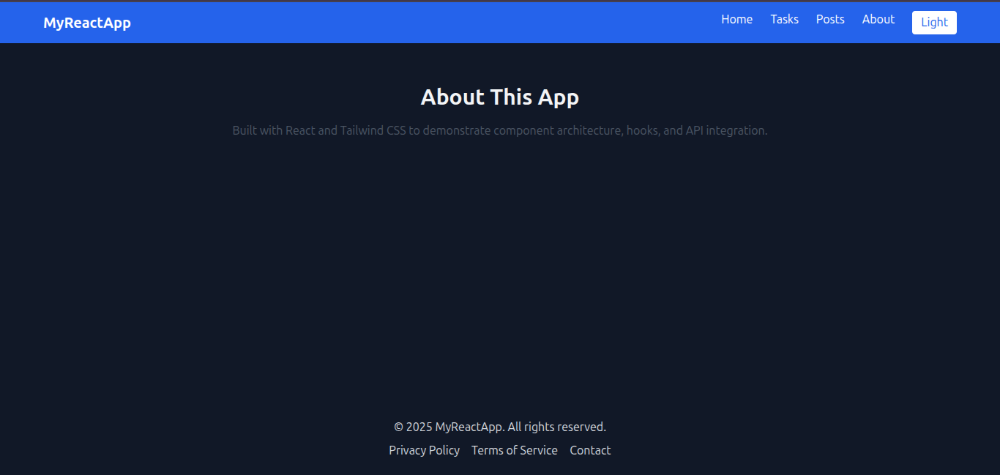

# React Task Manager Application

A modern React application built with Vite, featuring task management functionality, posts viewing, and theme switching capabilities. This project demonstrates the implementation of React best practices, context API usage, and responsive design with Tailwind CSS.



[Live Demo](https://react-js-jsx-and-css-mastering-fron-tau.vercel.app/) <!-- Replace with your deployment URL -->

## Features

- Task Management (Create, Read, Update, Delete)
- Posts viewing and interaction
- Dark/Light theme switching
- Responsive design
- Modern React practices (Hooks, Context API)
- Clean component architecture

## Technologies Used

- React 18
- Vite
- Tailwind CSS
- Context API for state management
- React Router for navigation
- Modern JavaScript (ES6+)

## Prerequisites

Before you begin, ensure you have installed:
- Node.js (v14.0.0 or higher)
- npm (v6.0.0 or higher)

## Installation

1. Clone the repository:
   ```bash
   git clone https://github.com/your-username/your-repo-name.git
   cd your-repo-name
   ```

2. Install dependencies:
   ```bash
   npm install
   ```

3. Start the development server:
   ```bash
   npm run dev
   ```

4. Open [http://localhost:5173](http://localhost:5173) to view it in your browser.

## Project Structure

```
src/
├── api/          # API integration
├── components/   # Reusable components
├── context/      # Context providers
├── pages/        # Page components
└── assets/       # Static assets
```

## Available Scripts

- `npm run dev` - Starts the development server
- `npm run build` - Builds the app for production
- `npm run preview` - Preview the production build locally

## Deployment Guide

### Option 1: Vercel (Recommended)

1. Create an account on [Vercel](https://vercel.com)
2. Install Vercel CLI:
   ```bash
   npm install -g vercel
   ```
3. Run:
   ```bash
   vercel login
   vercel
   ```

## Recommended Deployment: Vercel

For this project, I recommend using **Vercel** because:
1. Zero-configuration deployment
2. Automatic builds and deployments from Git
3. Seamless integration with React and Vite
4. Free tier with generous limits
5. Excellent performance and reliability

## Screenshots







